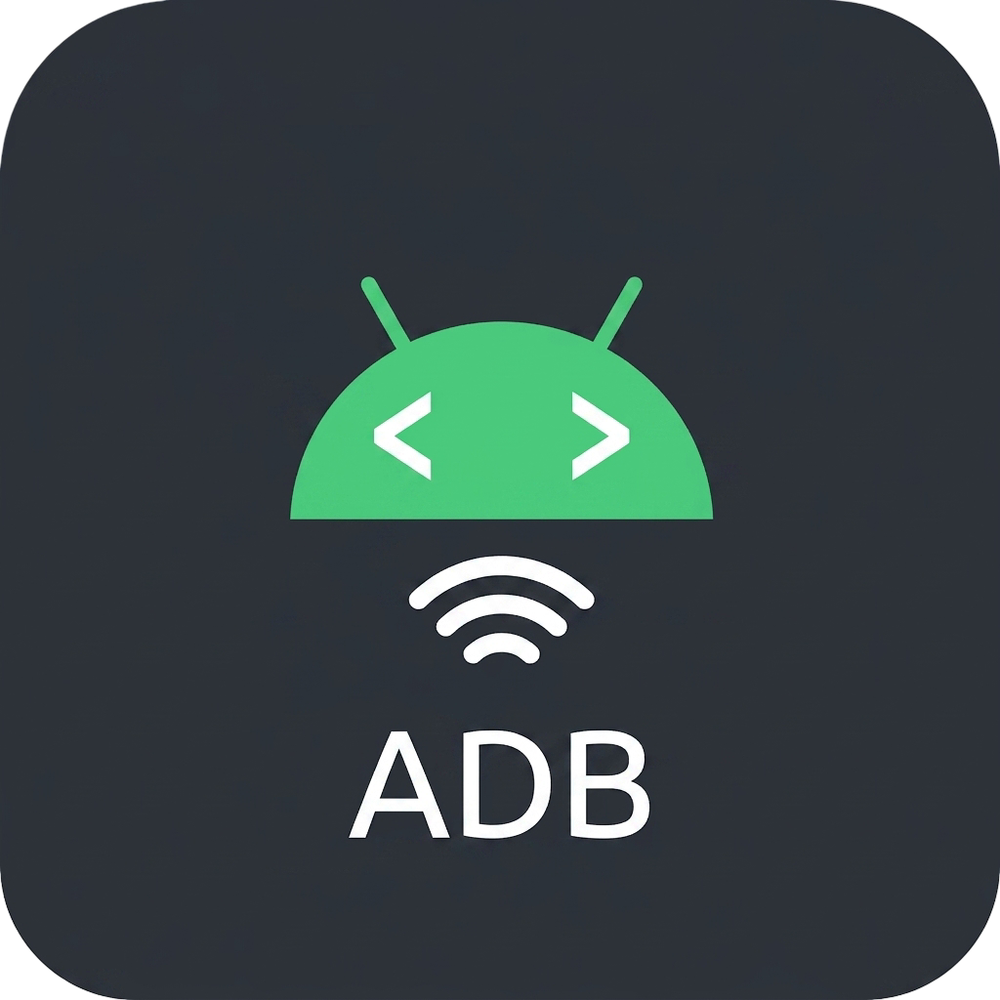

  
  <h1>Remote ADB Workspace</h1>
  
  
  
  

A VS Code extension providing a seamless UI that lets you do full-stack development right on your Android device.

The main goal of this project is to provide a lightweight VS Code extension that feels like [WSL](https://marketplace.visualstudio.com/items?itemName=ms-vscode-remote.remote-wsl) or [Remote-SSH](https://marketplace.visualstudio.com/items?itemName=ms-vscode-remote.remote-ssh), enabling developers to seamlessly browse, edit, and execute code workspaces directly on an Android/Termux device using **solely an ADB (Android Debug Bridge) connection**.

Unlike standard remote development extensions, it achieves a "Remote-SSH" style user experience **without** injecting a heavy, network-bound Node.js server binary into the target environment. This completely bypasses architecture constraints and `glibc` library execution barriers (such as Android’s native reliance on the Bionic C library).

---

## ⚠️ Beta Disclaimer & Consent

**Please note:** This project is currently in its **beta state**. It has not yet been tested across a wide variety of Android devices or custom ROMs, so **bugs are expected**. 

Additionally, most of the codebase was written with the assistance of an AI agent. However, every architectural decision, fallback strategy, and raw ADB command executed under the hood has been **deliberately chosen, curated, and vetted** to ensure safe and predictable behavior on your device.

---

## Core Features

Here is a breakdown of the core internal features powering the extension. Click the links for deep dives into how they work under the hood.

| Feature | Description | Full detail | Limitations |
|---------|-------------|-------------|-------------|
| 🔌 Device Connection & Management | Robust connection handling for both USB and wireless (TCP/IP) devices with automatic persistent tracking. | [Read more](docs/internal-features/01-device-connection-and-management.md) | [View Limitations](docs/internal-features/01-device-connection-and-management.md#limitations) |
| 👤 User Switching & Execution Contexts | Seamlessly switch your execution context between `shell`, `root`, `termux`, or custom app sandboxes using `run-as`. | [Read more](docs/internal-features/02-user-switching-and-execution-contexts.md) | [View Limitations](docs/internal-features/02-user-switching-and-execution-contexts.md#limitations) |
| 🛠️ Toybox Injection | Automatically injects a statically compiled toybox binary to ensure POSIX-compliant shell tools are always available. | [Read more](docs/internal-features/03-toybox-injection.md) | [View Limitations](docs/internal-features/03-toybox-injection.md#limitations) |
| ✅ Pickers & Validation | Interactive UI for folder/file selection with an automated `chmod` remediation pipeline to fix permission issues. | [Read more](docs/internal-features/04-pickers-and-validations.md) | [View Limitations](docs/internal-features/04-pickers-and-validations.md#limitations) |
| 📁 Remote File System & Caching | A lightning-fast native `vscode.FileSystemProvider` backed by a background `tar` caching engine. | [Read more](docs/internal-features/05-remote-filesystem-and-caching.md) | [View Limitations](docs/internal-features/05-remote-filesystem-and-caching.md#limitations) |
| 💻 Terminal Integration | Auto-starts an integrated ADB shell configured to your workspace's exact location and execution context. | [Read more](docs/internal-features/06-terminal-integration.md) | [View Limitations](docs/internal-features/06-terminal-integration.md#limitations) |
